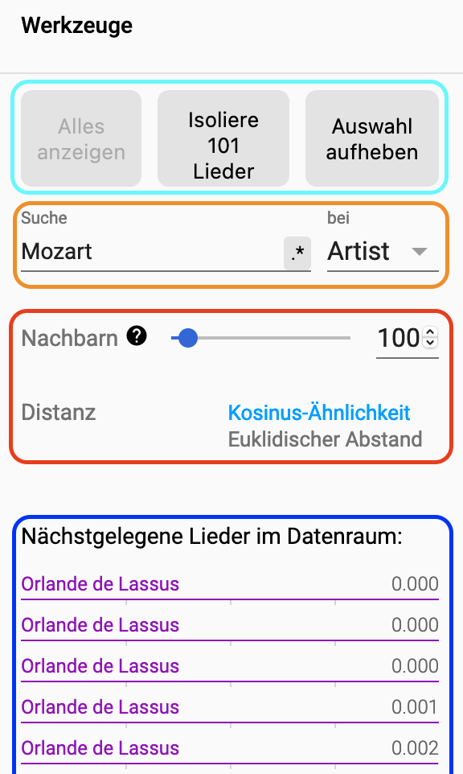

# Mozart Jukebox - Einführung

### Wie ähnlich ist Musik von Mozart, Bach oder Bruno Mars?
Menschliches Gehör erkennt sehr schnell Unterschiede zwischen Musikstücken. Kann ein Computer, genauer gesagt Künstliche Intelligenz (KI), das auch so einfach? Wenn ja, wie funk-tioniert das? Die Anwendung “Projekt Mozart Jukebox” zeigt Ihnen, wie ein Computer, wie eine KI, Komponisten und Künstler anhand ihrer Musik unterscheidet. Sie erfahren auch, wie Menschen Einfluss auf den Lernprozess und damit auf die Ergebnisse nehmen können. Viel Spaß! 

### Was ist die Mozart Jukebox?
Bei der Mozart Jukebox haben wir eine KI trainiert, 484 Musikstücke von 15 Komponisten und Musikern zu unterschieden, etwa wie Mozart oder Haydn aber auch Bruno Mars oder Michael Jackson. Die KI wurde so programmiert, dass sie ihre Interpretation der Musik dreidimensional darstellt und dadurch für das menschliche Auge sichtbar wird. 

### Blackbox KI – welchen Einfluss hat der Mensch?
Die KIs, die hier konzipiert und trainiert wurden, unterliegen zu einem Großteil menschlichen Entscheidungen. KI ist das Produkt eines Entwicklungsprozesses, der von Menschen gesteuert wird. Das Ergebnis ist daher abhängig von den Entscheidungen, die ein Mensch trifft. Durch die Mozart Jukebox können Sie das Zusammenspiel zwischen Mensch und KI sehen.

### Die KI sieht aber hört nicht! 
KI verwendet – anders als das menschliche Gehör – keine Klanginformationen, also Töne. Stattdessen wird eine sogenannte akustische Frequenzdarstellung über die Zeit verwendet. Das Ganze wird als Bild zusammengefasst und als Spektrogramm bezeichnet. Beispielsweise würde "Zauberflöte" von Wolfgang Amadeus Mozart so aussehen:

## Abhängig und gleichzeitig unabhängig vom Menschen. 
Wir verwenden in diesem Projekt zwei Arten von KIs: eine überwachte und eine unüberwachte KI. Beide versuchen, Stücke sinnvoll zusammenzufassen, etwa nach Künstler. Die überwachte KI hatte, während des Lernens, Zugriff auf Künstlerinformationen. Das heißt, das Stück oben stammt von Mozart. Dadurch konnte sie ihre Vorhersagen im Laufe des Trainings immer weiter verbessern. Stellen Sie sich vor, Sie würden eine Fremdsprache lernen und jemand gibt Ihnen Feedback zur korrekten Aussprache oder zur richtigen Wortwahl. 

Beim unüberwachten Prozess standen diese Informationen nicht zur Verfügung. Die KI musste während des Trainings selbst versuchen, für sich ähnliche Stücke zusammenzufassen und einer Kategorie zuzuordnen. Die Ergebnisse werden mit jedem Durchlauf weiter verbessert. 

C.PNG

## Überwacht/unüberwacht – Ergebnisse 
Bei der überwachten KI ist wichtig, dass die KI alle Musikstücke dem richtigen Künstler zuord-net. Dieser Prozess wird so oft wiederholt, bis die Ergebnisse zufriedenstellend sind. 

Bei der unüberwachten KI sollen die Musikstücke zusammengefasst und einer Kategorie zuge-ordnet werden. Festgelegt wird hier lediglich, wie viele Durchläufe es gibt. Aufgrund der feh-lenden Information werden auch Werke unterschiedlicher Künstler gruppiert und es können Wagner und Beethoven eng beieinander stehen; Werke von Mozart dagegen ganz unterschied-lich und weit auseinander liegend bewertet eingestuft werden. 

Das Ergebnis ist insgesamt unerwarteter und wirkt chaotischer. 

Das lädt zum Reflektieren ein: Welche Aspekte der Musikstücke hat die KI als wichtiger erach-tet als ich selbst? Würde ich die Lieder auch so zusammenfassen, wenn ich den Künstler nicht kennen würde? 

Wir, die FHWS, wünschen Ihnen viel Freude mit der Jukebox! 

# Bedienung
ÜBERSICHT.PNG
### Hauptsicht
Die Jukebox ist über die App und im Browser über https://mozart.fiw.fhws.de erreichbar. Nach dem Aufruf sehen Sie als Erstes das oben dargestellte Bild. Das ist die Sichtweise der KI auf die von uns ausgewählte Musik. Jedes Bild-Icon entspricht einem Musikstück. Die App können Sie wie gewohnt durch Touch oder Mausklick über Ihr Smartphone oder Ihren Computer be-dienen.

### Musikinfo und Player 
Über das Icon erhalten Sie weitere Informationen zum ausgewählten Musikstück: 
Bildschirmfoto 2021-04-29 um 16.46.18.png 

Sie können das Werk auch anhören: entweder in voller Länger, falls Sie in Ihrem Browser bei Spotify angemeldet sind, ansonsten nur einen kurzen Ausschnitt.

KIAuswahl.jpeg 
### Auswahl KI und Beschriftung
Rot markiert: Sie können in der App auswählen von welchem KI-Typ Sie die Sichtweise se-hen möchten. Dabei können Sie zwischen den Typen unüberwachte und überwachte KI ent-scheiden. 

Orange markiert: Bei der Darstellung in der Hauptsicht können Sie entscheiden, ob die klei-nen Bilder mit dem Künstlernamen, dem Album oder dem Liedtitel beschriftet werden sollen. Zusätzlich können Sie die Bilder nach Künstler färben lassen. 

Blau markiert: Die Daten sphärisch darzustellen heißt, kurz die Lieder auf einen Globus aufzu-tragen und darzustellen. 

### Werkzeuge und Suche 
Bei der Auswahl eines Musikstücks erscheint außerdem eine Werkzeugleiste: 

Türkis markiert: Die App selektiert nach der Auswahl eines Liedes automatisch die nächsten Lieder und markiert sie zusätzlich in der Hauptsicht. Diese Selektion kann auch isoliert betrach-tet werden und somit nur diese Lieder in der Hauptsicht angezeigt werden. 

Orange markiert: Über die Suchleiste können Sie nach Stücken suchen, etwa nach Namen des Stücks, Komponist oder Album.

Rot markiert: Über den Schieberegler können Sie festlegen, wie viele Nachbarn von der An-wendung automatisch ausgewählt werden sollen. Zudem können Sie festlegen, wie die App Nähe definieren soll. 

Blau markiert: Die nächsten 101 Stücke werden hier aufgelistet jeweils mit der zugehörigen Distanz zum ausgewählten Stück. 

# Rechtliches, Datenschutz und Impressum
Rechtliche Informationen, Datenschutzerklärung sowie Impressum sind in der APP "Mozart & More" ([App Store](https://apps.apple.com/de/app/mozart-more/id1560225415) oder [Play Store](https://play.google.com/store/apps/details?id=de.augmentedart.mozartfest&hl=de&gl=US)) dargelegt. 